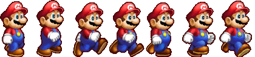

---
layout: post
title: "Canvas Game Charecter animation"
author: "Yeon"
---

# Canvas Game Charecter animation

## Make Charecter
### Canvas 게임 만들기를 시작

Canvas Class에서 Charecter를 관리하는 방식으로 시작
### Canvas, Charecter Class
```javascript 
class Canvas {
    constructor(id) {
        this.canvas = null;
        this.context = null;
        this.charecter = null;
        ...
    }
    init() {
        this.canvas = document.createElement('canvas');
        this.context = this.canvas.getContext('2d');
    }
}

class Charecter {
    constructor(options) {
        this.options = options;
    }
}
```

이미지를 로드 및 Charecter 생성
### Image load
```javascript 
let charImage = new Image();
charImage.src = "./images/run.png";
this.charecter = new Charecter({
    context: this.context,
    width: cnst.charWidht,
    height: cnst.charHeight,
    x: cnst.charX,
    y: cnst.charY,
    image: charImage
});
```

<br><br><br>

이미지 그리기
### Image draw
```javascript 
this.context.drawImage(
    this.image,
    this.frameIndex * this.width,
    0,
    this.width,
    this.height,
    this.x,
    this.y - this.gravity,
    this.width,
    this.height);
```

이미지 frame update code
~~~
frameIndex = 현재 진행중인 이미지 index
tickCount = 현재 진행중인 animation count
ticksperFrame = 다음 이미지 index로 넘어갈 animation count
numberOfFrames = 사용하고있는 이미지 frame
~~~
### Image update
```javascript
update() {
    this.tickCount += 1;
        if (this.tickCount > this.ticksperFrame) {
            this.tickCount = 0;

            if (this.frameIndex < this.numberOfFrames - 1) {
                this.frameIndex +=1;
            } else {
                this.frameIndex = 0;
            }
        }
}
```

이미지 clear Rect
drawImage를 지속적으로 호출하여 그리는 방식이기 때문에 clearRect를 함께 해주어야함
```javascript
render() {
    this.clearRender();
    this.drawImage();
}

clearRender() {
    this.options.context.clearRect(0, 0, cnst.canvasWidth, cnst.canvasHeight);
}
```

이미지 animation frame 동작
브라우저 requestAnimationFrame 사용하여 render 함수 지속적 호출
setInterval로도 대체 가능할 것으로 보임
### Image animation frame
```javascript
renderCharecter() {
    window.requestAnimationFrame(this.renderCharecter.bind(this));

    this.charecter.update();
    this.charecter.render();
}
```

[참고: CREATE A SPRITE ANIMATION WITH HTML5 CANVAS AND JAVASCRIPT](http://www.williammalone.com/articles/create-html5-canvas-javascript-sprite-animation/)