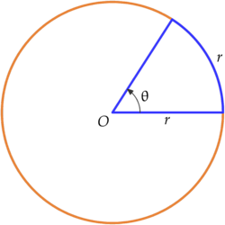

# Trigonometrical function (삼각함수)

### Radian
> 호도법 : 각의 크기를 나타내는 방법에는 여러 가지가 있는데, 그 중 널리 쓰이는 것은 육십분법과 호도법이다.
 
반지름의 길이가 인 원 위에 길이가 인 호를 잡을 때, 이 호에 대한 중심각의 크기는 반지름의 길이 에 관계없이 일정하다. 이때 이 크기를 단위로 각을 측정하는 방법을 호도법이라고 하며, 이 단위를 라디안(radian)이라고 한다.        [네이버 지식백과] 호도법 [radian measure, circular measure] (수학백과, 2015.5, 대한수학회)

#### 일반각 계산법

#### 1 radian
중심각의 크기  는 반지름의 길이에 관계없이 항상 일정하다. 이 일정한 각의 크기를 호도 또는  라디안(radian)이라 하고  radian 또는  rad이라고 쓴다.

라디안을 단위로 하여 각의 크기를 나타내는 방법을 호도법이라고 한다. 호도법(radian measure)을 영어로 circular measure,  measure, natural measure라고 하기도 한다.

#### 각도와 실수
#####**특수각**  
180도 = 파이  
90도 = 파이/2  
60도 = 파이/3  
45도 = 파이/4  
30도 = 파이/6  

#### 삼각비

[참고: Trigonometrical function](https://www.inflearn.com/course-status-2/)