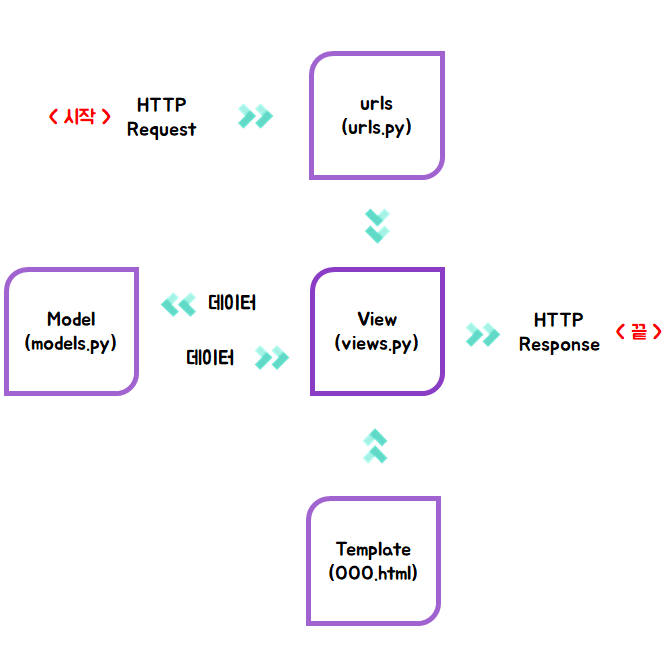

# Django 란?
파이썬으로 만들어진 무료 오픈소스 웹 애플리케이션 프레임워크(web application framework)입니다파이썬으로 만들어진 무료 오픈소스 웹 애플리케이션 프레임워크(web application framework)
## Django MTV 패턴
- model, template, view

## Django 구조
#### 프로젝트 Directory
~~~
$ django-admin.py startproject conf .
~~~

> 프로젝트_이름/  
----project/  
--------project/  
-----------|-__init__.py  
-----------|-settings.py  
-----------|-urls.py  
-----------|-wsgi.py  
--------manage.py  
----venv/

- project : Django 애플리케이션 소스 코드 디렉토리 = 저장소 커밋 관리
- manage.py : Django 프로젝트와 다양한 방법으로 상호작용 하는 커맨드라인의 유틸리티 입니다.
- project/ 디렉토리 내부에는 project 를 위한 실제 Python 패키지들이 저장됩니다. 이 디렉토리 내의 이름을 이용하여, (mysite.urls 와 같은 식으로) project 어디서나 Python 패키지들을 import 할 수 있습니다.
- project/__init__.py : Python 으로 하여금 이 디렉토리를 패키지 처럼 다루라고 알려주는 용도의 단순한 빈 파일입니다.
- project/settings.py : 현재 Django project 의 환경/구성을 저장합니다.
- project/urls.py : 현재 Django project 의 URL 선언을 저장합니다. Django 로 작성된 사이트의 "목차" 라고 할 수 있습니다.
- project/wsgi.py : 현재 project 를 서비스 하기 위한 WSGI 호환 웹 서버의 진입점 입니다.
- venv : 종속성 분리의 원칙에 따라 프로젝트의 독립적인 가상환경을 제공한다. 파이썬 3.4 버전부터는 별도의 virtualenv 패키지 설치하지 않고 가상환경 디렉토리를 만들 수 있다.

#### WSGI
웹서버와 파이썬을 사용한 웹 어플리케이션 개발환경 간의 인터페이스에 대한 규칙
WSGI는 웹서버와 웹 어플리케이션(또는 프레임워크) 간에 호환성있는 웹 어플리케이션 개발환경을 만들기 위해 로우-레벨 인터페이스로 만들어졌다.

#### virtualenv
파이썬 프로젝트 개발을 하다보면 복수의 패키지를 설치하게되고, 이는 다른 모든 패키지에 영향을 주게된다
virtualenv는 시스템 환경변수 PATH를 조작하여 파이썬을 완전히 독립된 환경에서 사용할 수 있게 해줌

##### 애플리케이션 파일 구조
~~~
$ python manage.py startapp app
~~~
> app  
----__init__.py  
----admin.py  
----apps.py  
----migrations/  
----models.py  
----tests.py  
----views.py  

###### 추가 가능한 파일
- urls.py: 앱의 URL 패턴 선언  
- forms.py: 입력 폼 선언  
- behaviors.py: 모델 믹스인 위치에 대한 옵션  
- constants.py: 앱에 쓰이는 상수 선언  
- decorators.py: 데코레이터  
- db/: 여러 프로젝트에서 용되는 커스텀 모델이나 컴포넌트  
- fields.py: 폼 필드  
- factories.py: 테스트 데이터 팩토리 파일  
- helpers.py: 뷰와 모델 파일을 가볍게 하기 위해 유틸리티 함수 선언  
- managers.py: models.py가 너무 커질 경우 커스텀 모델 매니저가 위치  
- signals.py: 커스텀 시그널  
- viewmixins.py: 뷰 모듈과 패키지를 더 가볍게하기 위해 뷰 믹스인을 이 모듈로 이전  

[참고: Django 프로제그 및 앱 구조](https://wikidocs.net/6609)