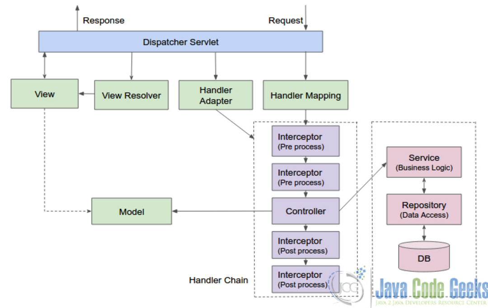

# Spring MVC?

Spring Web MVC는 서블릿 API를 기반으로 작성된 최초의 웹 프레임 워크이며 처음부터 Spring Framework에 포함되어있다. 정식 이름 "Spring Web MVC"는 소스 모듈 spring-webmvc 의 이름에서 유래 되었지만 더 일반적으로 "Spring MVC"로 알려져 있습니다.
MVC는 Model-View-Controller의 약자이다.
- Model : 데이터 처리 영역
- View : 결과 (화면)
- Controller : 요청을 처리, Model과 View 통신 역할 수행

## 처리과정
 


1. 모든 요청을 DispatcherServlet에서 요청을 받는다.  
2. servlet-context.xml에서 등록된 Controller를 HandlerMapping을 통해 찾아낸다.  
3. @RequestMapping에 맞게 요청을 처리할 메서드로 이동  
4. Controller에서 비즈니스 로직을 수행, Model, View에 반영  
	- Controller는 요청처리 Service를 주입받아 비즈니스로직을 수행  
	- 데이터베이스 처리는 필요한 DAO를 주입받아 DB처리는 DAO에게 위임
  
	- DAO는 mybatis 등의 설정을 이용하여 유정보를 받아 서비스에게 리턴  
5. Controller는 view파일에 대한 정보를 DispatcherServlet에게 보냄.  
6. DispatcherServlet은 ViewResolver에 View 정보를 보냄  
7. ViewResolver는 JSP(응답 View)를 찾아 DispatcherServlet에게 알림  
8. DispatcherServlet에서 응답할 View에게 랜더링을 지시하고 View는 랜더링 수행  
9. DispatcherServlet이 클라이언트에게 랜더링된 View를 보냄  
 
 
## SpringMVC && Spring Boot
두가지에 대한 명확한 차이는 spring boot는 프로젝트를 만듦에 있어 설정에 대한 간편성이 가장 큰것 같다.
- 다른 견해로는 간단한 웹어플리케이션 개발의 경우 spring boot를 사용하여 내부 임베디드 컨테이너로 사용하는 것이 이점이 있다고한다.
- 규모가 큰 웹사이트에서는 불안정한 임베디드 컨테이너를 사용하기보단 Spring MVC 사용이 안정적이라는 견해도 있었다.

